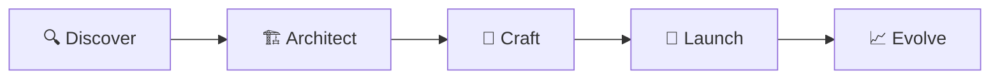

<p align="center">
  <picture>
    <source media="(prefers-color-scheme: dark)" srcset="/public/assets/logos/namelogo.png">
    
  </picture>
</p>

<h1 align="center">RiverLoom</h1>
<p align="center">
  <strong>Premium Software Engineering Studio</strong>
</p>

<p align="center">
  <a href="https://riverloom.in"></a>
  <a href="https://github.com/riverloom"></a>
  <a href="https://linkedin.com/company/riverloom"></a>
  <a href="https://x.com/riverloom"></a>
  <br>
  <a href="https://nextjs.org"></a>
  <a href="https://react.dev"></a>
  <a href="https://www.typescriptlang.org"></a>
  <a href="https://tailwindcss.com"></a>
  <a href="https://framer.com/motion"></a>
  <a href="https://threejs.org"></a>
  <br>
  
  
  
</p>

---

## ✦ Overview

**RiverLoom** is an elite software engineering studio that architects, designs, and engineers world-class AI systems, platforms, and digital products for ambitious companies worldwide.

We partner with businesses ranging from funded startups to Fortune 500 enterprises — shipping everything from AI-powered platforms and mobile apps to enterprise SaaS and cloud infrastructure.

> *"We don't bolt on AI — we architect systems where intelligence is core to the design."*

### ✦ What We Build

| Area | Examples |
|------|----------|
| **AI Systems** | LLM fine-tuning, AI agents, computer vision, predictive analytics |
| **Platform Engineering** | Internal developer platforms, CI/CD, enterprise tooling |
| **Mobile Applications** | iOS & Android (Flutter, React Native, Swift, Kotlin) |
| **SaaS Platforms** | Multi-tenant architecture, subscription billing, admin dashboards |
| **Web Applications** | Marketing sites, complex web apps, e-commerce |
| **Cloud & DevOps** | Kubernetes, infrastructure-as-code, observability |

---

## ✦ Featured Products

| Product | Description | Status |
|---------|-------------|--------|
| [**Chandriva Club**](https://chandrivaclub.com) | Complete hotel management & CRM platform | 🟢 Live |
| [**MalwareX**](https://play.google.com/store/apps/details?id=com.malwarex.app) | AI-powered mobile cyber defense | 🟢 Live |
| [**Wordique**](https://play.google.com/store/apps/details?id=com.akhil.wordique) | Interactive vocabulary learning platform | 🟢 Live |
| [**VisiLearn**](https://visilearn.vercel.app) | AI & NLP education with interactive visualizations | 🟢 Live |
| [**Apoet**](https://play.google.com/store/apps/details?id=co.riek.apoet) | Creative platform for poetry & artistic expression | 🟢 Live |
| **BuildHub** | Hotel CRM platform | 🔧 In Development |
| **Universe** | College ERP platform | 🔧 In Development |

See our full portfolio at **[riverloom.in/work](https://riverloom.in/work)**.

---

## ✦ Services

```
┌─────────────────────────────────────────────────────────────┐
│  AI Solutions         Platform Engineering  Custom Software │
│  Mobile Development   SaaS / CRM / ERP      Digital Growth  │
│  Cloud & DevOps       Web Development        Product Design │
└─────────────────────────────────────────────────────────────┘
```

| Service | Description |
|---------|-------------|
| **AI Systems & Intelligent Automation** | Custom LLMs, AI agents, computer vision, predictive analytics |
| **Platform Engineering & Internal Tools** | Developer platforms, CI/CD, enterprise tooling |
| **Digital Products & Custom Software** | Enterprise apps, microservices, multi-tenant SaaS |
| **Mobile Application Development** | Flutter, React Native, native iOS & Android |
| **SaaS, CRM & ERP Development** | Subscription platforms, admin dashboards, integrations |
| **Digital Marketing & Ad Campaigns** | Google & Meta ads, performance marketing, ROI attribution |
| **Cloud, DevOps & API Integration** | AWS/Azure/GCP, Kubernetes, CI/CD pipelines |
| **Website & Web Application Dev** | Next.js, React, TypeScript, 95+ Lighthouse scores |

---

## ✦ Our Process



| Phase | What We Do |
|-------|-----------|
| **Discover** | Deep-dive workshops, stakeholder interviews, market analysis, technical audits |
| **Architect** | System design, data models, deployment topology, security architecture |
| **Craft** | Iterative development with weekly shipping, code reviews, automated testing |
| **Launch** | Zero-downtime deployments, performance validation, monitoring setup |
| **Evolve** | Data-driven iterations, feature evolution, proactive optimization |

---

## ✦ Tech Stack

### Frontend


### Backend & AI


### Infrastructure


**60+ technologies** — see full stack at **[riverloom.in](https://riverloom.in)**.

---

## ✦ Project Structure

```
riverloom/
├── public/                    # Static assets
│   ├── assets/
│   │   ├── brands/           # Client brand logos
│   │   ├── icons/            # Product icons
│   │   ├── images/           # Hero images, project visuals
│   │   ├── logos/            # Company & client logos
│   │   ├── techicons/        # Technology stack icons
│   │   └── videos/           # Video assets
│   └── projects/             # Project-specific files
├── src/
│   ├── app/                  # Next.js App Router pages
│   │   ├── about/            # About page & sections
│   │   ├── api/              # API routes (contact, etc.)
│   │   ├── cancellation-policy/
│   │   ├── careers/
│   │   ├── contact/
│   │   ├── privacy/          # Privacy policy
│   │   ├── privacy-policy/
│   │   ├── process/          # Our process page
│   │   ├── refund-policy/
│   │   ├── services/         # Services pages
│   │   ├── solutions/        # Solution pages
│   │   ├── terms/
│   │   ├── terms-and-conditions/
│   │   └── work/             # Portfolio / work pages
│   ├── components/
│   │   ├── about/            # About section components
│   │   ├── layout/           # Navbar, Footer, layouts
│   │   ├── legal/            # Legal page components
│   │   ├── sections/         # Homepage section components
│   │   │   ├── hero/
│   │   │   ├── clients/
│   │   │   ├── services/
│   │   │   ├── work/
│   │   │   ├── tech-premium/
│   │   │   ├── process/
│   │   │   ├── testimonials/
│   │   │   ├── why/
│   │   │   └── cta/
│   │   ├── seo/              # SEO & analytics components
│   │   ├── solutions/        # Solution page components
│   │   └── ui/               # Reusable UI primitives
│   ├── data/                 # Data layer (services, products, etc.)
│   ├── hooks/                # Custom React hooks
│   ├── lib/                  # Utility functions & config
│   └── types/                # TypeScript type definitions
├── .gitignore
├── next.config.ts
├── package.json
├── postcss.config.mjs
├── tsconfig.json
└── README.md
```

---

## ✦ Getting Started

```bash
# Clone the repository
git clone https://github.com/riverloom/riverloom.git
cd riverloom

# Install dependencies
npm install

# Start the development server
npm run dev
```

Open **[http://localhost:3000](http://localhost:3000)** in your browser.

### Available Scripts

| Command | Description |
|---------|-------------|
| `npm run dev` | Start development server with Turbopack |
| `npm run build` | Production build |
| `npm start` | Start production server |
| `npm run lint` | Run ESLint |

### Environment Variables

Create a `.env.local` file:

```env
NEXT_PUBLIC_SITE_URL=https://riverloom.in
NEXT_PUBLIC_EMAIL=contact@riverloom.in
NEXT_PUBLIC_GTM_ID=GTM-XXXXXXX
# ... see src/lib/site-config.ts for all options
```

---

## ✦ Core Technologies

| Category | Technologies |
|----------|-------------|
| **Framework** | Next.js 15 (App Router, SSR, Streaming) |
| **Language** | TypeScript 5.5 |
| **UI** | React 19, Tailwind CSS 4, Framer Motion 12 |
| **3D** | Three.js, @react-three/fiber, @react-three/drei |
| **Animation** | GSAP, Framer Motion |
| **Forms** | react-hook-form |
| **Icons** | Lucide React |
| **Fonts** | Plus Jakarta Sans (variable font) |
| **Deployment** | Vercel (recommended) |
| **Analytics** | Google Analytics, Google Tag Manager, Meta Pixel, LinkedIn Insight, Microsoft Clarity, Hotjar |

---

## ✦ Our Clients

We've partnered with leading companies across industries — from AI platforms and fintech to healthcare and enterprise SaaS. Our client logos represent real partnerships, not aspirational branding.

---

## ✦ Contact

| Channel | Details |
|---------|---------|
| **Website** | [riverloom.in](https://riverloom.in) |
| **Email** | contact@riverloom.in |
| **GitHub** | [github.com/riverloom](https://github.com/riverloom) |
| **LinkedIn** | [linkedin.com/company/riverloom](https://linkedin.com/company/riverloom) |
| **X** | [@riverloom](https://x.com/riverloom) |

---

<p align="center">
  <sub>Built with ❤️ by the RiverLoom Team</sub>
  <br>
  <sub>© 2020–Present RiverLoom. All rights reserved.</sub>
</p>
